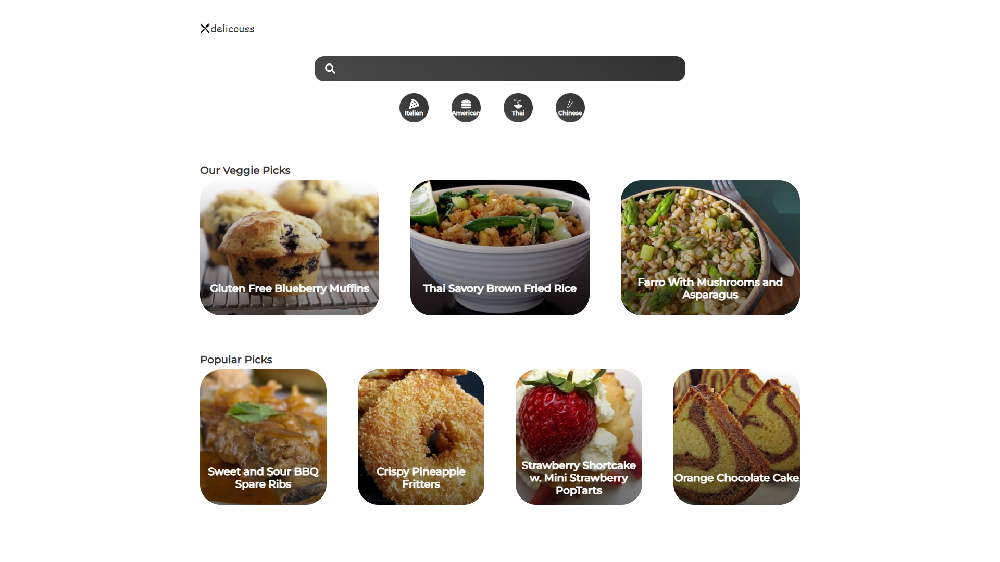
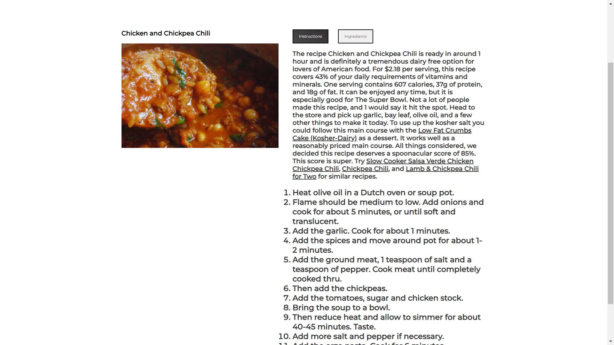

# Delicious Recipe

Delicious Recipe is a web app made with ReactJS that uses the Spoonacular API to provide different types of Recipes with ingredients and step-by-step instructions. It has also a searchbar through which you can search any recipe.

## Technologies Used

* ReactJs
* HTML
* CSS
* JavaScript
* Spoonacular API

### NPM Packages Used

* styled-components
* react-router-dom
* framer-motion
* react-icons
* react-splide
